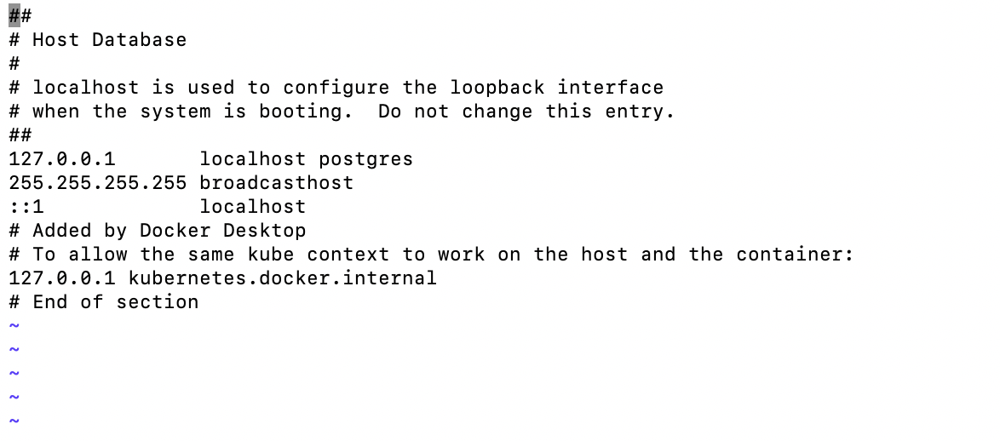
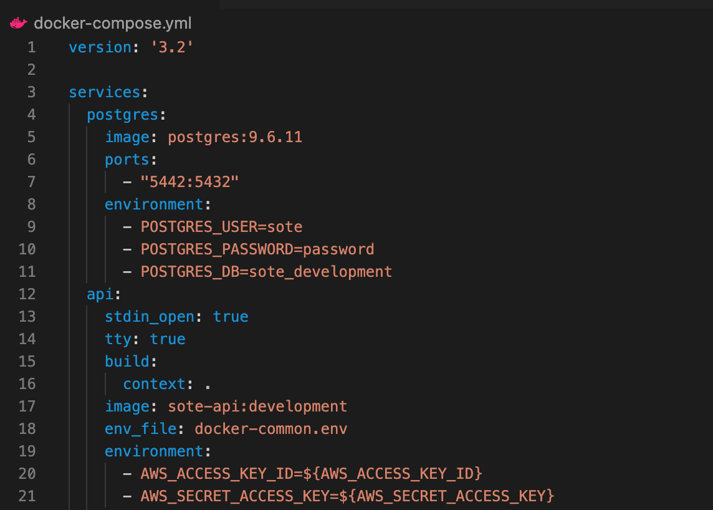
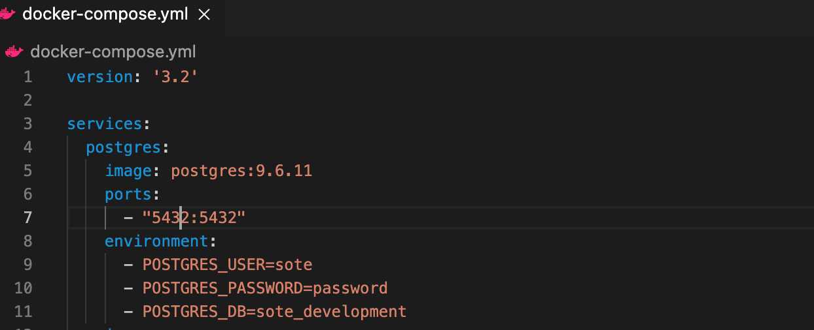

# Requirements

- You must have postgres as an alias to localhost for this to work in /etc/hosts 

   #### BEFORE
   

   #### AFTER
   

- You must have postgres port as 5432 in dockerapi/containerctl.sh You have to restart or re-setup your docker after you make this change
   #### BEFORE
   

   #### AFTER
   

