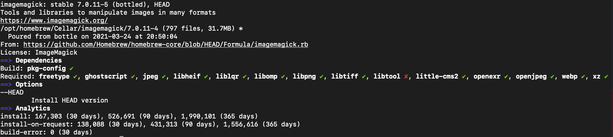

# Requirements

- You must have postgres as an alias to localhost for this to work in /etc/hosts 

   #### BEFORE
   

   #### AFTER
   

- You must have postgres port as 5432 in dockerapi/containerctl.sh You have to restart or re-setup your docker after you make this change
   #### BEFORE
   

   #### AFTER
   

- You must have ImageMagick installed to convert inbound documents to PDF
  #### To install, run:
  
  ```brew install ImageMagick```
  
  #### Check ImageMagick's  information after install. Install dependencies if they are missing. Information it 
  #### should be  similar to attached image, run:

  ```brew info ImageMagick```
  ####
  

  #### Add this option to the preprocessor. To allow supply of system-specific preprocessor options that GCC does not recognize
  
  ``echo 'export CGO_CFLAGS_ALLOW="-Xpreprocessor"' >> ~/.zhsrc``