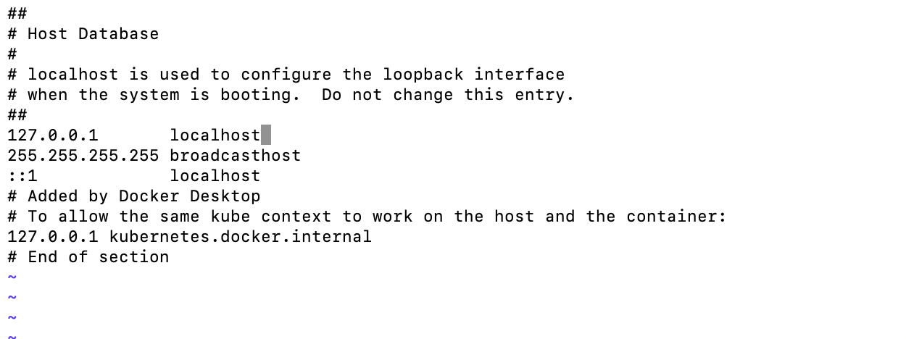

# Requirements

- You must have postgres as an alias to localhost for this to work in /etc/hosts 

   #### BEFORE
   

   #### AFTER
   

- You must have postgres port as 5432 in dockerapi/containerctl.sh
   #### BEFORE
   

   #### AFTER
   
